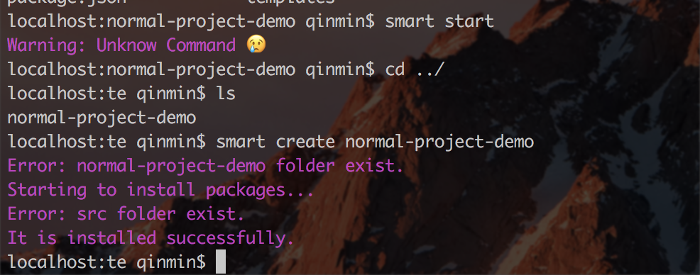

# smart-project-demos

- 先安装 **smart** 

	[**smart 程序地址**](https://github.com/09boy/boy-smart)

- 在demo目录父级执行安装命令，以smart-project-react 项目为例:
	
	````
	smart create-react smart-project-reat
	````
	
	你会看到如下提示:
	
	
	这是正确的。然后你进入到 smart-project-react 目录，执行命令:
	
	````
	smart start
	````
	
	启动了端口为 3000 的本地server.
	
	
